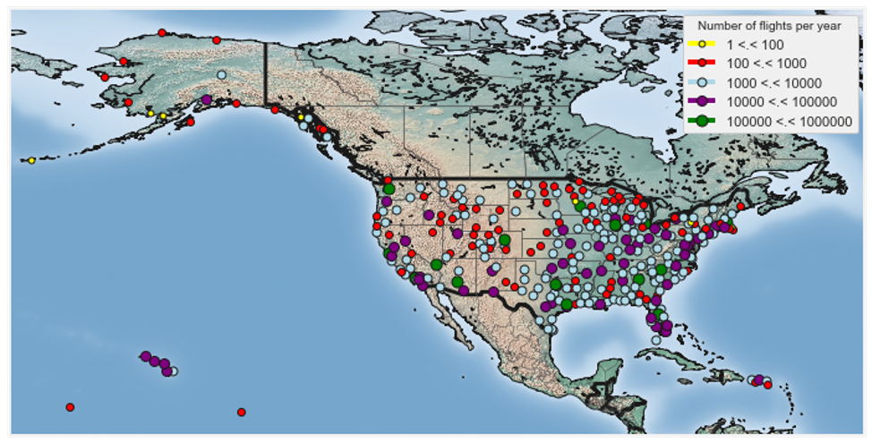
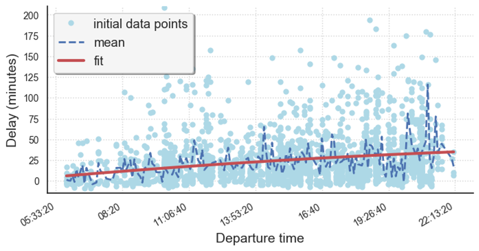

## Predicting flight delays in the U.S.
### Project Type: Data Analysis and Machine Learning

In this project, I develop a model aimed at predicting flight delays at take-off. I comment on the importance of the separation of the dataset during the training stage and how cross-validation helps determine accurate model parameters. I show how to build linear and polynomial models for univariate or multivariate regressions.

### [Medium Article - Will your flight be late?](https://medium.com/analytics-vidhya/will-your-flight-be-late-36818ffe52b3?source=friends_link&sk=b12b06c3463c125b1370650e8b52bc9f) 
